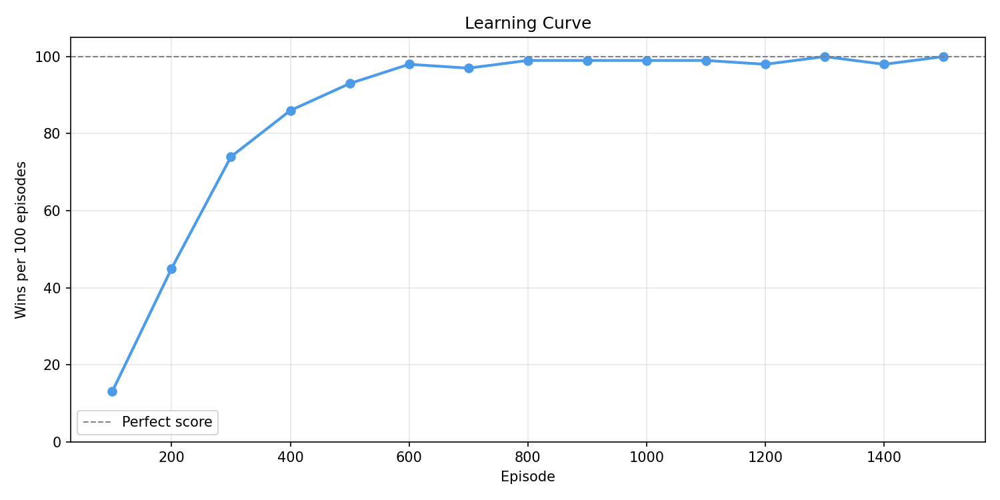
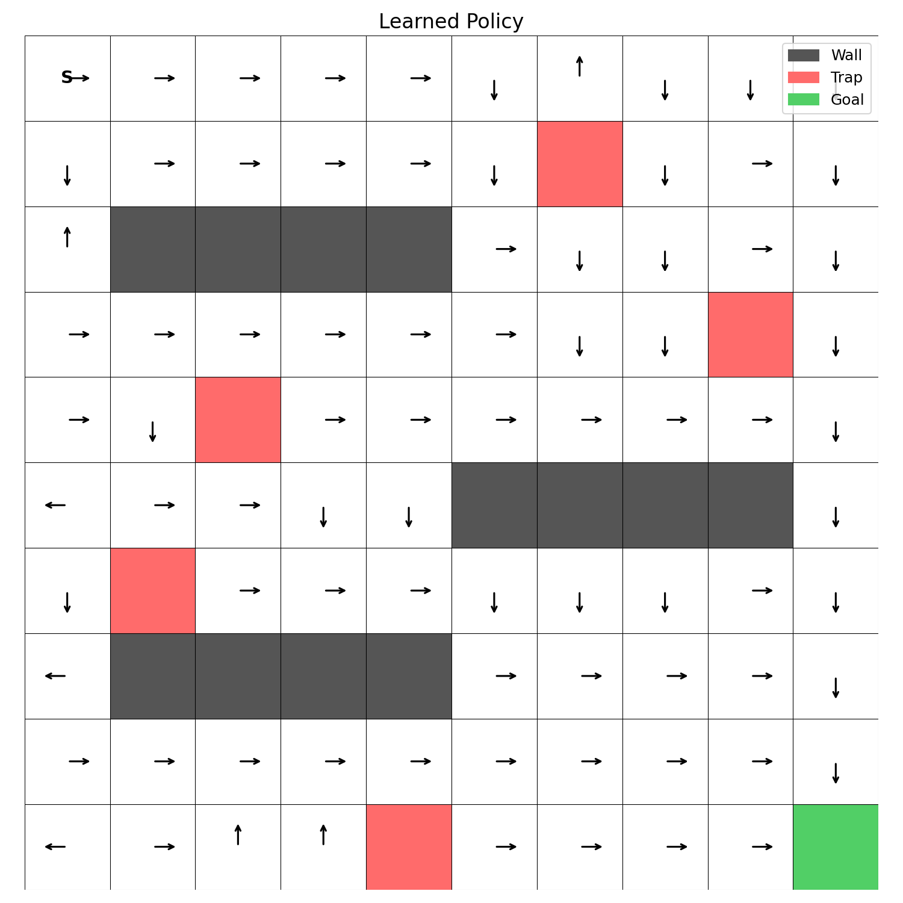

# Drone Grid RL

A reinforcement learning agent that learns to navigate a 10×10 grid from start (🛩️) to goal (🎯) while avoiding walls and traps.

## What is Reinforcement Learning?

Reinforcement learning (RL) is a method of training an agent by having it interact with an environment through trial and error. At each step the agent picks an action, receives a reward signal, and uses that feedback to improve future decisions — no labeled training data required. Over many episodes the agent learns which actions lead to high cumulative reward.

RL is a natural fit here because the optimal path through the grid cannot be hard-coded: it depends on the layout of walls and traps, and the agent must discover it purely from experience.

## Approach: Q-Learning

This project uses **Q-Learning**, a model-free, off-policy RL algorithm. It maintains a table of Q-values — one per (state, action) pair — representing the expected future reward of taking that action from that state. After each step the table is updated with the Bellman equation:

```
Q(s, a) ← Q(s, a) + α [ r + γ · max Q(s', a') − Q(s, a) ]
```

- **α (learning rate)** — how much each new experience overwrites the old estimate
- **γ (discount factor)** — how much future rewards are weighted vs. immediate ones
- **r** — reward received after taking action *a* in state *s*
- **max Q(s', a')** — the best known value of the next state

Exploration is handled with an **epsilon-greedy** policy: with probability ε the agent picks a random action (explore), otherwise it picks the action with the highest Q-value (exploit). ε decays after each successful episode so the agent gradually shifts from exploring to exploiting as it learns.

## Alternatives to Q-Learning

### SARSA (on-policy TD)

SARSA is nearly identical to Q-Learning but uses the action *actually taken* in the next state rather than the theoretical best action:

```
Q(s, a) ← Q(s, a) + α [ r + γ · Q(s', a') − Q(s, a) ]
```

Because the update reflects the agent's real behaviour (including exploratory random moves), SARSA is more conservative — it learns to avoid states near traps even when ε is still high. In this grid, SARSA would likely steer clear of cells adjacent to 🧨 more cautiously than Q-Learning, at the cost of slightly slower convergence to the optimal path.

### Monte Carlo

Monte Carlo methods wait until the end of an episode before updating Q-values, using the actual total return instead of a bootstrapped estimate. This means every Q-value update is unbiased — there is no estimation error from `max Q(s', a')`. The downside is that updates are sparse: nothing is learned mid-episode, so convergence on a 10×10 grid with a 200-step budget would be significantly slower. Monte Carlo also struggles with long episodes where the agent rarely reaches the goal early in training.

### Deep Q-Network (DQN)

DQN replaces the lookup table with a neural network that maps a state to Q-values for all actions. This is necessary when the state space is too large for a table — raw pixel inputs or continuous coordinates, for example. On this 10×10 grid the table has only 400 entries and DQN would be overkill: the network overhead (experience replay buffer, target network, gradient updates) adds complexity with no benefit. DQN becomes the right choice once the grid grows large enough that tabular Q-Learning can no longer fit in memory or generalise across unseen states.

### Policy Gradient (e.g. REINFORCE, PPO)

Policy gradient methods skip the value function entirely and directly optimise a parameterised policy π(a|s). Instead of asking *"what is the value of this action?"* they ask *"how should I adjust the policy to make good actions more probable?"*. They handle continuous action spaces naturally and tend to converge to more stable policies. On a small discrete grid like this one they are unnecessarily complex, but they would become the preferred approach if the action space were continuous (e.g. thrust and steering angle for a real drone) or if the policy needed to generalise across many different grid layouts.

## Grid

```
+────────────────────+
|🛩️                  |
|            🧨      |
|  🧱🧱🧱🧱          |
|                🧨  |
|    🧨              |
|          🧱🧱🧱🧱  |
|  🧨                |
|  🧱🧱🧱🧱          |
|                    |
|        🧨        🎯|
+────────────────────+
```

| Symbol | Meaning | Reward |
|--------|---------|--------|
| 🛩️ | Start (agent) | — |
| 🎯 | Goal | +10 |
| 🧨 | Trap | −10 |
| 🧱 | Wall | blocked |
|    | Empty | −1 |

The −1 step penalty on empty cells discourages the agent from wandering and encourages finding the shortest safe path.

## Hyperparameters

| Parameter | Value |
|-----------|-------|
| Learning rate α | 0.1 |
| Discount γ | 0.9 |
| Initial ε | 0.3 |
| Min ε | 0.01 |
| ε decay | ×0.995 per goal |
| Episodes | 1500 |

The Q-table is stored as a `(rows, cols, actions)` numpy array and persisted to `qtable.json` after training.

## Learning Curve

Win rate per 100 episodes across 1500 training episodes:



## Learned Policy

Arrows show the greedy action (highest Q-value) the agent takes in each cell after training:



## Getting Started

```bash
uv run main.py          # train and save qtable.json
uv run visualize.py     # regenerate assets/
```
